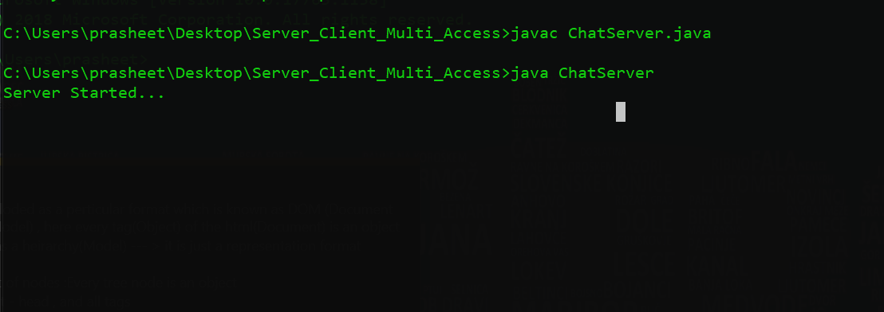
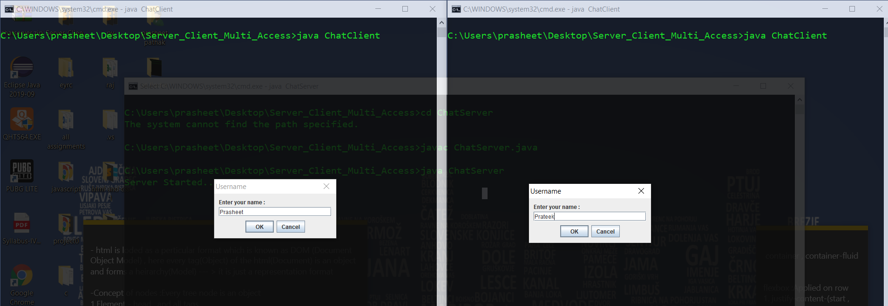
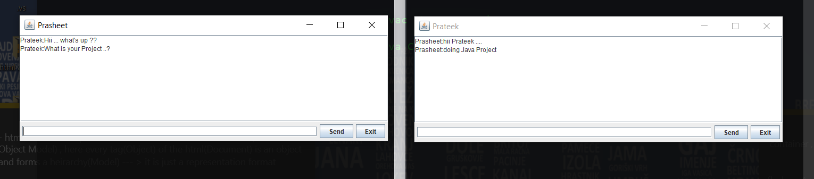
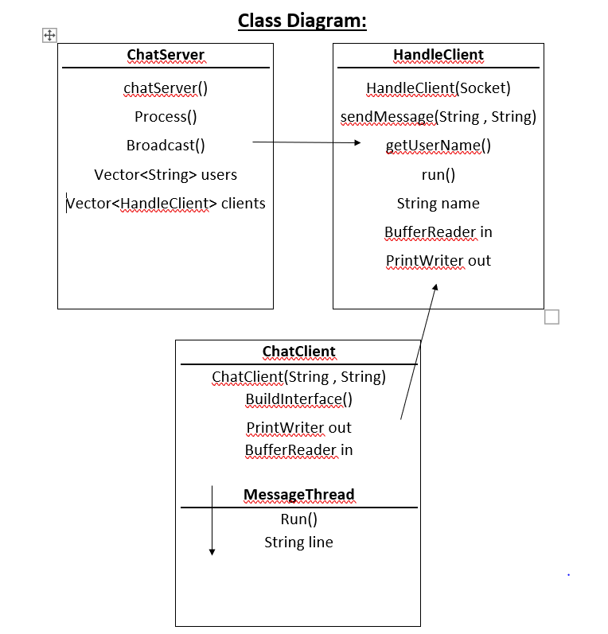
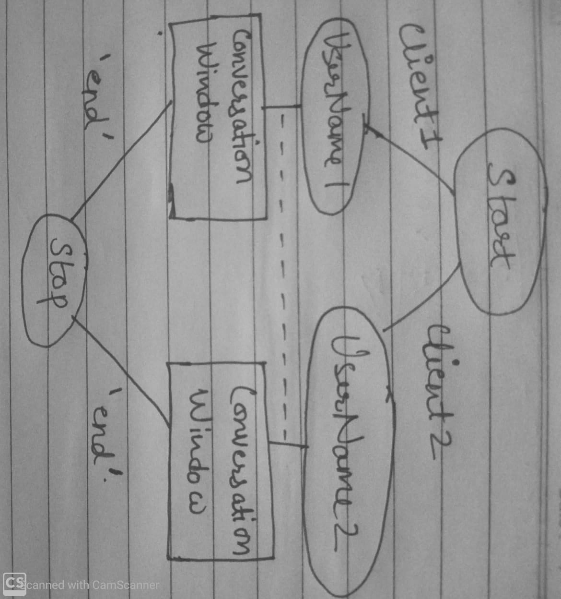

# Boradcasting Chat Server Project :

**Objective** : Users can Interact to each other . They can broadcast messages to every working user.

**Users Of System**  :
- Clients(Who will interact)

**Functional Requirements** :
-Clients
1.Clients can connect to themselves by giving there user name .
2.Clients can Send or Recieve messages form other clients at the time .
3.Client can give username to itself .

**Tools Used** :
1.NetBeans IDE

**How project Works(Stepwise)** :

1.Server needs to be started first

2.Clients(users) have to give there username that to displayed while Broadcasting .

3.Client can start sending and recieving messages using window .

**Class Diagram :**

**Activity Diagram :**

